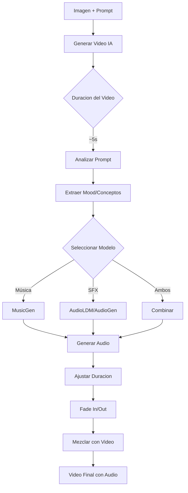

# Plan: Sistema de Audio para Video al Estilo Grok Imagine

## Análisis de Grok Imagine

### Cómo funciona Grok Imagine:

1. **Image + Prompt → Video (~3-5 segundos)**
   - Usa modelos de difusión latent para video
   - Genera movimiento natural siguiendo el prompt

2. **Audio automático basado en el contenido**
   - **Música/ambiente**: Genera audio que coincide con el "mood" del video
   - **Efectos de sonido**: Sincronizados con la acción del video
   - **Duración**: El audio se ajusta automáticamente a la duración del video

### Modelos que Grok podría usar para audio:

| Tipo | Modelo | Descripción |
|------|--------|-------------|
| Música | **MusicGen** (Meta) | Generación de música a partir de texto |
| Audio | **AudioLDM** | Generación de audio ambiente/SFX |
| SFX | **AudioGen** | Generación de efectos de sonido |
| TTS | **XTTS-v2** | Narración con clonación de voz |

---

## Plan de Implementación

### Fase 1: Mejora del Sistema de Audio Actual

#### 1.1 Añadir soporte para MusicGen (Meta)
```
MusicGen puede generar música a partir de:
- Texto ("upbeat electronic music, dance")
- Referencia de audio (style transfer)
- Descripción de mood ("calm, relaxing, nature sounds")
```

#### 1.2 Mejorar AudioLDM
```
- Optimizar para generación más rápida
- Añadir prompts específicos para diferentes tipos de audio
- Mejorar calidad de salida
```

#### 1.3 Sistema de análisis de prompt
```
Extraer del prompt del video:
- Mood/emoción: "happy", "sad", "tense", "calm"
- Tipo de audio: "music", "nature", "urban", "sci-fi"
- Intensidad: "soft", "loud", "fast beat"
```

### Fase 2: Sincronización Video-Audio

#### 2.1 Duración automática
```
- LTX-Video (24fps): 121 frames = 5.04s → generar 5s de audio
- HunyuanVideo (16fps): 81 frames = 5.06s → generar 5s de audio
- CogVideoX (16fps): 49 frames = 3.06s → generar 3s de audio
```

#### 2.2 Fade in/out
```
- Aplicar fade in de 0.5s al inicio
- Aplicar fade out de 0.5s al final
- Evitar cortes bruscos en el audio
```

#### 2.3 Mezcla con ffmpeg
```
- Combinar video + audio generado
- Ajustar volumen si es necesario
- Normalizar niveles de audio
```

### Fase 3: Interfaz de Usuario

#### 3.1 Opciones de audio en UI
```
┌─────────────────────────────────────┐
│ 🎵 Audio Automático (Grok Style)    │
├─────────────────────────────────────┤
│ • Generar música basada en el mood  │
│ • Efectos de sonido sincronizados   │
│ • Duración: automática al video     │
├─────────────────────────────────────┤
│ Opciones:                           │
│ [ ] Música ambiente                 │
│ [ ] Efectos de sonido               │
│ [ ] Narración (TTS)                 │
└─────────────────────────────────────┘
```

---

## Archivos a Modificar

### 1. `roop/audio_generator.py`
- Añadir función `generate_music(prompt, duration, output_path)`
- Mejorar `generate_sound()` con más opciones
- Añadir función `analyze_audio_prompt(prompt)` para extraer conceptos

### 2. `ui/tabs/animate_photo_tab.py`
- Añadir sección "Audio Automático" con opciones:
  - Música basada en mood
  - Efectos de sonido
  - Combinación
- Mejora de UI para audio

### 3. `roop/comfy_workflows.py`
- Workflows para video ya implementados ✓

---

## Diagrama de Flujo: Audio al Estilo Grok Imagine



---

## Código de Ejemplo: Generación de Música

```python
def generate_music(prompt, duration=5.0, output_path=None, style_ref=None):
    """
    Genera música usando MusicGen basada en el prompt.
    
    Args:
        prompt: Descripción de la música ("upbeat electronic dance music")
        duration: Duración en segundos
        output_path: Ruta de salida
        style_ref: Audio de referencia para style transfer (opcional)
    
    Returns:
        Path al audio generado o None si falla
    """
    try:
        from transformers import MusicGenPipeline
        import torch
    except ImportError:
        print("💡 Instalar: pip install transformers")
        return None
    
    device = "cuda" if torch.cuda.is_available() else "cpu"
    
    # Cargar modelo (diferentes tamaños disponibles)
    model = MusicGenPipeline.from_pretrained(
        "facebook/musicgen-small",  # small, medium, large
        torch_dtype=torch.float16 if device == "cuda" else torch.float32
    )
    model = model.to(device)
    
    # Generar
    if style_ref:
        # Style transfer con referencia
        audio = model.generate(
            description=prompt,
            reference_audio=style_ref,
            duration=duration
        )
    else:
        # Generación desde texto
        audio = model.generate(
            descriptions=[prompt],
            duration=duration
        )
    
    # Guardar
    import scipy.io.wavfile
    output_path = output_path or f"music_{hash(prompt)}.wav"
    scipy.io.wavfile.write(output_path, rate=32000, data=audio[0, 0])
    
    return output_path
```

---

## Siguientes Pasos

1. **Revisar y aprobar este plan**
2. **Instalar dependencias** (transformers para MusicGen)
3. **Implementar Fase 1**: Mejora del sistema de audio
4. **Implementar Fase 2**: Sincronización video-audio
5. **Implementar Fase 3**: UI mejorada
6. **Probar y optimizar**
